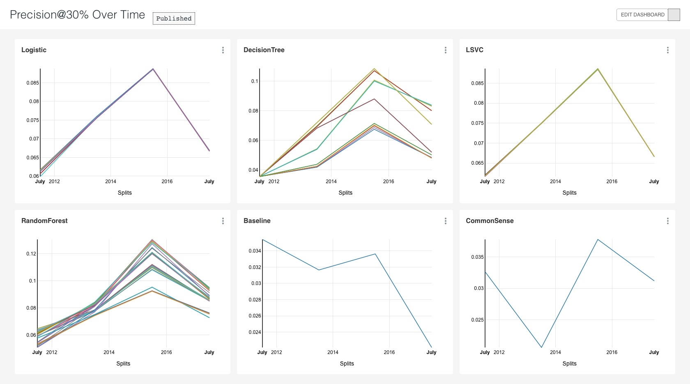
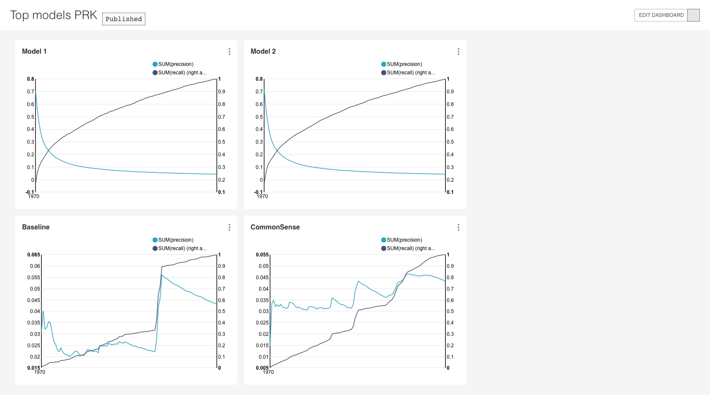

# Experiment Configuration

`skeleton_newlabels.yaml` contains the latest experiment config. Below is a visualization of its tasks: 

 

# Modeling Dashboards

## Precision @ 30%

 

## PRK Curves

 